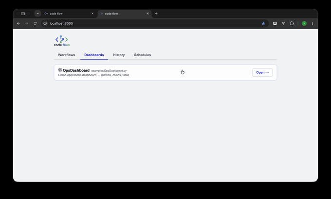

<p align="center"></p>

A tiny **workflow engine** in Python with a web UI — flows are plain
Python functions, every run is a report you can read later.

## Demo

[](https://vimeo.com/1212565346)

*(5× speed preview — click for the [full demo on Vimeo](https://vimeo.com/1212565346))*

## Why code-flow

- **See the values later.** Run a test or an API call and inspect what
  happened afterwards — every execution is stored as an HTML report with
  inputs, per-step logs, context and outputs. Most lightweight tools don't
  give you history.
- **Lightweight by design.** Run a sequence of steps without bringing up a
  whole server farm, a queue, and a big bunch of setup. One process, one
  `pip install`, done.
- **Just Python.** No proprietary format, no custom DSL — a workflow is a
  plain Python class with a `@flow` body. Flexible to build, and easy to
  generate with AI later.
- **Versioned with git.** Flows are code files, so branching, reviewing and
  rolling back come for free — less work to maintain.

## Quick start

**macOS / Linux**

```bash
bash scripts/install.sh   # venv + deps, asks where your workflows folder is
bash scripts/start.sh     # starts the server and opens the browser
```

**Windows** — double-click `scripts\install.bat`, then `scripts\start.bat`
(needs [Python 3.10+](https://www.python.org/downloads/) with "Add to PATH"
ticked).

The installer writes your choices to `.codeflow.env` (workflows path, port);
edit that file or re-run the installer to change them. If you point it at an
empty folder it offers to copy the sample flows in. All available settings
are documented in [`.codeflow.env.sample`](.codeflow.env.sample) — copy it
to `.codeflow.env` if you prefer configuring by hand.

Manual alternative:

```bash
pip install -r requirements.txt
python app.py
# open http://127.0.0.1:8000
```

## Run in Docker

The image contains only the engine + web app. Your `workflows/`,
`environments/` and `history/` folders stay on the host and are
volume-mounted, so you edit flows with your normal editor and the UI picks
them up live — no rebuild, no restart.

```bash
docker compose up --build -d
# open http://localhost:8000
```

The mounts are defined in `docker-compose.yml`:

```yaml
volumes:
  - ./workflows:/data/workflows        # your flows (live-editable)
  - ./environments:/data/environments  # env JSON files
  - ./history:/data/history            # reports persist across rebuilds
```

Point them anywhere you like, e.g. `- ~/my-flows:/data/workflows`. Inside
your flow files keep importing `from engine import ...` — the engine is
installed in the image and resolves regardless of where the flows live.

Without compose:

```bash
docker build -t codeflow .
docker run -d -p 8000:8000 \
  -v "$PWD/workflows:/data/workflows" \
  -v "$PWD/environments:/data/environments" \
  -v "$PWD/history:/data/history" \
  --name codeflow codeflow
```

The folder locations are plain environment variables
(`CODEFLOW_WORKFLOWS_DIR`, `CODEFLOW_ENVIRONMENTS_DIR`,
`CODEFLOW_HISTORY_DIR`, plus `CODEFLOW_HOST` / `CODEFLOW_PORT`), so the
same mechanism works outside Docker too.

If your flows need extra Python packages (requests, pandas, ...), add them
to `requirements.txt` and rebuild — the mounted flow files themselves never
require a rebuild.

## Defining a workflow

Drop any `.py` file into the `workflows/` folder — **subfolders included,
any depth**. Every subclass of `Workflow` with a `@flow` method is picked up
automatically (no restart needed — the UI re-scans the folder). Files or
folders starting with `_` are ignored, so `_drafts/` is a handy place for
work in progress, and `_lib/` is where shared code goes.

Subfolders double as organization: every folder on a flow's path is added
to its tags automatically. A flow in `workflows/billing/Invoices.py` gets a
`billing` tag and shows up under that tag in the UI's tag bar and history
filters — no need to declare it in the class.

**A workflow is a class with one `@flow` body. The body is ordinary
Python; the `@step` methods it calls are journaled.**

```python
from dataclasses import dataclass
from typing import Literal

from engine import Workflow, flow, step, parallel_map

@dataclass                            # typed inputs -> a real form + validation
class DeployInputs:
    service: Literal["payments", "orders"] = "payments"
    canary: bool = True

class DeployFlow(Workflow):
    description = "Shown in the UI"
    tags = ["devops"]                 # UI grouping/filtering
    inputs = DeployInputs

    @flow
    def main(self, ctx):                               # ctx = inputs + env
        artifact = self.build(ctx["service"])          # journaled step call
        hosts = self.discover_hosts(ctx["service"])

        if ctx["canary"]:                              # a real if
            self.push(artifact, hosts[0])
            self.verify(hosts[0])

        parallel_map(lambda h: self.push(artifact, h), hosts[1:], workers=3)

        try:                                           # a real try/except
            self.smoke_test(ctx["service"])
        except Exception:
            self.rollback(ctx["service"])
            raise

        return {"deployed": True}                      # merged into outputs

    @step(retry=2, retry_delay=1, retry_backoff=2,
          retry_on=ConnectionError, timeout=30)
    def push(self, artifact, host):
        self.log(f"pushed {artifact} to {host}")
        return host
```

Steps take real arguments and return real values. Control flow is `if`,
`for`, `while`, `try` — there is no `next=`, `condition=` or `loop=`.

### `@step` reference

| Parameter | Meaning |
|-----------|---------|
| `name`        | Label in the report (defaults to the method name) |
| `retry`       | Retries after failure (total attempts = retry + 1) |
| `retry_delay` | Seconds between attempts |
| `retry_backoff` | Multiplier applied each further attempt: `retry_delay=2, retry_backoff=3` waits 2s, 6s, 18s… Default 1 = fixed |
| `retry_on`    | Exception class/tuple that is retryable, e.g. `retry_on=(ConnectionError, TimeoutError)`. Other exceptions fail immediately |
| `continue_on_error` | After all attempts fail, mark the step FAILED and return `None` to the caller instead of raising |
| `timeout`     | Max seconds per attempt; raises `StepTimeoutError`. The timed-out call is abandoned, not killed — make such steps duplicate-safe |

Retries, timeouts and journaling apply **per call**, so a step called in a
loop gets independent attempts and its own journal entry per iteration.

### The one rule: keep the body pure

On ⏭ resume the flow body **re-executes from the top** — completed steps
return their recorded result instantly, so execution effectively continues
where it stopped. That only works if the body is deterministic:

- Real work and side effects go **inside steps**, never in the body.
- No `datetime.now()`, `random`, `uuid` in the body — put them in a step, or
  use `self.sleep(seconds)` which is journaled and cancellable.

`bash scripts/lint.sh` flags violations (rules CF030/CF031).

### Runtime features

- **Context**: the `@flow` body receives `ctx` — validated inputs plus
  `ctx["env"]`. Step results are ordinary return values; nothing is
  auto-merged into a shared dict.
- **Branching / loops**: plain Python (`if`, `for`, `while`, `try`).
- **Parallel**: `parallel_map(self.step_method, items, workers=8)` — each
  call is journaled separately. Threads: good for I/O, not for CPU.
- **Pausing**: `self.sleep(30)` is cancellable and journaled, so a resumed
  run does not sleep again.
- **Logging**: `self.log("...")` lines appear in the HTML execution report.
  Structured variants: `self.log_json(obj, title=...)` renders pretty JSON,
  `self.log_table(rows, title=...)` renders a real table (200-row cap).
- **Images**: `self.log_image(path_or_bytes_or_figure, title="Sales chart")`
  attaches an image to the step, shown inline in the run's report. Accepts
  file paths (png/jpg/gif/svg/webp), raw bytes (`format="svg"`), data URIs,
  and matplotlib figures. Images embed as base64 so reports stay
  self-contained (3 MB/image, 20/step caps).
- **Outputs**: `self.outputs({"key": value})` records workflow outputs.

### Reliability

- **Incremental persistence**: every step transition is written to disk, so
  even a crashed server leaves an honest partial record. On startup, runs
  that were RUNNING when the previous process died are marked
  **INTERRUPTED** in the history.
- **Resume**: FAILED / CANCELLED / INTERRUPTED runs have a ⏭ resume button
  (and `POST /api/runs/<id>/resume`). The flow body replays from the top and
  every step that already completed returns its recorded result instantly —
  including loop iterations, so a failed loop continues at the failed item.
  Completed steps appear in the new report marked "carried over". Keep step
  results JSON-serializable for an exact restore, and see the rule above
  about keeping the body pure. Try `workflows/examples/ResumeDemo.py`.
- **Cancellation**: every RUNNING run has a ✕ cancel button (also
  `POST /api/runs/<id>/cancel`). Cancel is cooperative — it takes effect at
  the next step boundary, loop iteration, retry wait, or timeout poll; a
  step that is mid-execution without a `timeout=` finishes first.
  Cancelling a run also cancels its sub-workflows.
- **Timeouts**: `timeout=30` on a step bounds each attempt. Timed-out and
  cancelled step calls are abandoned (Python threads can't be killed), so
  design steps with external side effects to be idempotent.

### Dashboards

Any workflow becomes a dashboard by setting `dashboard = True` and building
widgets in its steps:

```python
class OpsDashboard(Workflow):
    dashboard = True

    @step(name="Build")
    def build(self, ctx):
        self.widget("metric", title="Orders", value=128)
        self.widget("stat", title="Revenue", value="€12.4k", delta="+8%")
        self.widget("status", title="API", value="online", status="ok")   # ok/warn/err
        self.widget("progress", title="Quota", value=64, max=100)
        self.widget("chart", title="Sales", chart="bar",                  # bar/line/area/pie
                    data={"Books": 850, "Games": 1200}, size="wide")
        self.widget("table", title="Orders", rows=[{"id": 1, ...}], size="full")
        self.widget("list", items=[...]); self.widget("alert", text="…", level="warn")
        self.widget("section", title="Overview")   # full-width divider
```

The **Dashboards** tab lists dashboard flows; opening one runs the flow and
renders the widgets in a grid (size `"wide"` spans 2 columns, `"full"` the
whole row). The toolbar has Refresh, auto-refresh (10s–5m), and an
environment picker. **Input widgets**: an input bar is generated from the
flow's typed `inputs` dataclass (or inferred from plain dict defaults) — change
the values and Refresh (or press Enter) re-runs the flow with them; typed
validation applies and auto-refresh uses the current values too.
**Conditional cell formatting**: table widgets accept `format=` rules —
`{"col": "status", "map": {"paid": "ok", "failed": "err"}}` for value→style
maps, or comparisons `{"col": "amount", "gt": 300, "style": "err"}` with
`eq/ne/gt/gte/lt/lte/contains`; first matching rule wins. Styles:
`ok` `warn` `err` `info` `muted`. Tables sort on click and export to CSV; charts are
dependency-free inline SVG. Dashboard refreshes are **transient** — they
don't create history entries (auto-refresh would flood it); use the normal
Run button for a persisted snapshot with a report. Deep-link a dashboard
with `/#dashboards/<FlowName>`. See `workflows/examples/OpsDashboard.py`.

### Typed inputs

Declare inputs as a **dataclass** and set `inputs` to the class. The run
dialog becomes a proper form (text/number/checkbox/dropdown) instead of a
JSON box, with validation on every start path — UI, API, webhook,
scheduler, sub-workflow:

```python
from dataclasses import dataclass, field
from typing import Literal, Optional

@dataclass
class OrderInputs:
    customer: str                                     # no default => required
    amount: float = field(default=120.0,
                          metadata={"min": 0.01, "help": "order total"})
    priority: Literal["low", "normal", "high"] = "normal"
    notify: bool = False
    extra: Optional[dict] = None

class OrderFlow(Workflow):
    inputs = OrderInputs        # the class itself, not an instance
```

The annotation picks the field type:

| annotation | field |
|---|---|
| `str` | text |
| `int` | number (integer) |
| `float` | number |
| `bool` | checkbox |
| `Literal[...]` or an `Enum` subclass | dropdown |
| `list` / `dict` / anything else | JSON box |
| `Optional[X]` | `X`, not required |

A field with no default is **required**. Things an annotation can't express
go in `field(metadata={...})`: `min`, `max`, `help`, `label`, `options`,
`required`, `type`. `Annotated[int, {"min": 1}]` works too.

Values are coerced (`"42"` → `42`, `"true"` → `True`); bad inputs get a
`422` with per-field errors from the API, and runs started any other way
fail fast with a clear validation message instead of a confusing crash
mid-flow. Keys not declared pass through untouched, the flow body still
receives a plain dict `ctx`, and the run dialog keeps an "edit as JSON"
escape hatch.

Typing is optional: `inputs = {"amount": 120}` still works as plain
untyped defaults, it just skips validation and renders a generic form.

### Webhook triggers

Let external systems start a flow. Opt in on the class:

```python
class DeployFlow(Workflow):
    webhook = True
    # webhook_token = "s3cret"   # optional per-flow secret
```

```bash
curl -X POST localhost:8000/api/hooks/DeployFlow \
  -H "Content-Type: application/json" \
  -H "X-Webhook-Token: s3cret" \
  -d '{"version": "1.4.2"}'          # body = inputs; ?env=prod also works
# -> {"run_id": "…", "workflow": "DeployFlow"}
```

Auth: the flow's `webhook_token` if set, else the `CODEFLOW_WEBHOOK_TOKEN`
env var if set, else open (fine on localhost). Flows without
`webhook = True` return 404. Runs land in the history like any other.

### Scheduler

The **Schedules** tab lets you run flows automatically:

- **every N minutes** (interval), or **daily at HH:MM** with optional
  weekday selection — times are the *server's* local time
- each schedule carries its own inputs (JSON) and environment
- toggle on/off, ▶ run now, delete; the table links to the last run's report
  and shows the last error if a fire failed (e.g. flow renamed)
- schedules persist in `history/schedules.json` (so the Docker history
  volume keeps them); if the server was down when a schedule was due, it
  fires once at startup, not once per missed period
- **overlap guard**: if the previous run of a schedule is still RUNNING when
  the next fire is due, the fire is skipped and retried next tick — slow
  flows never stack up concurrent runs (manual ▶ run-now is not guarded)
- **history retention**: only the newest `CODEFLOW_HISTORY_LIMIT` runs are
  kept (default 500); older finished runs and their reports are pruned
  automatically, RUNNING entries never
- API: `GET/POST /api/schedules`, `PATCH/DELETE /api/schedules/{id}`,
  `POST /api/schedules/{id}/run`

## Web UI

- Lists every flow found in `workflows/` with a **▶ Run** button
- **History** table with live status (auto-refreshes every 2 s)
- Every execution is stored as an **HTML report** under `history/` and served
  at `/reports/<run_id>` — including inputs, environment, per-step logs,
  outputs, and a **Context** section with the workflow's context values
  (updated live while the run progresses; secret-looking keys masked,
  oversized values truncated, the `env` dict shown in its own section)
- Multiple flows (or the same flow multiple times) run **concurrently** on a
  thread pool
- REST API: reference in [`docs/API.md`](docs/API.md), interactive Swagger
  at `/api/docs`
- Writing flows: see [`docs/BEST_PRACTICES.md`](docs/BEST_PRACTICES.md)
- **Linting**: `bash scripts/lint.sh` (or `python -m engine.lint workflows`)
  — catches duplicate step names, missing/duplicate `@flow`, leftover
  graph-era syntax, `retry=` without `timeout=`, swallowed exceptions,
  secrets in log lines, import-time side effects, and non-determinism or
  side effects in a flow body. Exit code 1 on
  errors; `--strict` also fails on warnings. Run it in pre-commit/CI —
  especially for AI-generated flows.
- Generating flows with AI: point your LLM at [`llms.txt`](llms.txt) — a
  complete, compact engine reference (paste it into the prompt and ask for
  the flow you want)

## Project layout

```
code-flow/
├── app.py            # FastAPI server + REST API
├── ui.html           # single-page web UI
├── engine/
│   ├── decorators.py # @flow / @step
│   ├── workflow.py   # Workflow base class
│   ├── runner.py     # execution engine (journal, replay, retries)
│   ├── registry.py   # auto-discovery of workflows/
│   ├── lint.py       # codeflow lint
│   └── reports.py    # HTML reports + history store
├── workflows/        # ← your flows live here (subfolders = groups/tags)
│   ├── Flow.py
│   ├── Flow2.py
│   └── examples/
│       └── HelloFlow.py
├── environments/     # ← env JSON files (dev.json, prod.json, ...)
└── history/          # execution reports (html + json)
```
