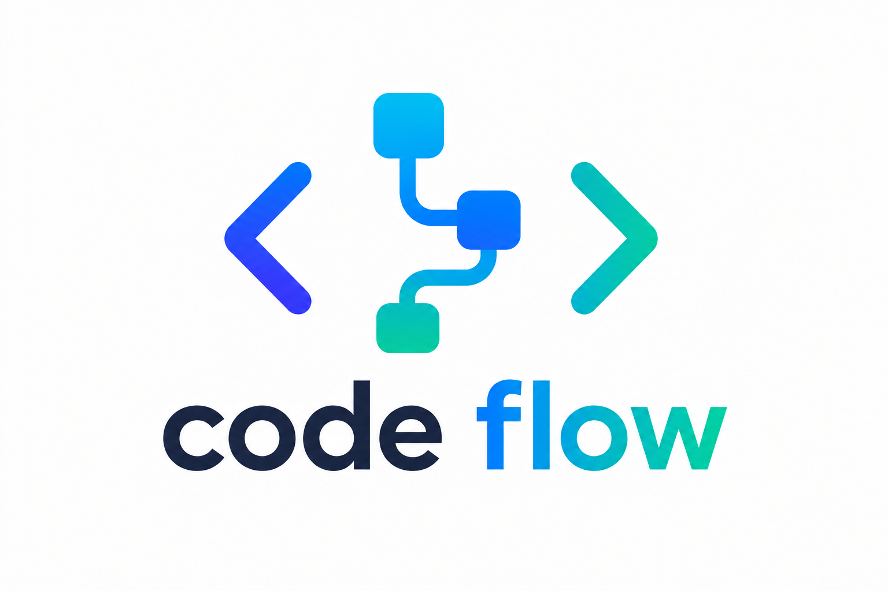

<p align="center"></p>

A tiny **annotation-based workflow engine** in Python with a web UI.

## Why code-flow

- **See the values later.** Run a test or an API call and inspect what
  happened afterwards — every execution is stored as an HTML report with
  inputs, per-step logs, context and outputs. Most lightweight tools don't
  give you history.
- **Lightweight by design.** Run a sequence of steps without bringing up a
  whole server farm, a queue, and a big bunch of setup. One process, one
  `pip install`, done.
- **Just Python.** No proprietary format, no custom DSL — a workflow is a
  plain Python class with decorators. Flexible to build, and easy to
  generate with AI later.
- **Versioned with git.** Flows are code files, so branching, reviewing and
  rolling back come for free — less work to maintain.

## Quick start

```bash
pip install -r requirements.txt
python app.py
# open http://127.0.0.1:8000
```

## Run in Docker

The image contains only the engine + web app. Your `workflows/`,
`environments/` and `history/` folders stay on the host and are
volume-mounted, so you edit flows with your normal editor and the UI picks
them up live — no rebuild, no restart.

```bash
docker compose up --build -d
# open http://localhost:8000
```

The mounts are defined in `docker-compose.yml`:

```yaml
volumes:
  - ./workflows:/data/workflows        # your flows (live-editable)
  - ./environments:/data/environments  # env JSON files
  - ./history:/data/history            # reports persist across rebuilds
```

Point them anywhere you like, e.g. `- ~/my-flows:/data/workflows`. Inside
your flow files keep importing `from engine import ...` — the engine is
installed in the image and resolves regardless of where the flows live.

Without compose:

```bash
docker build -t codeflow .
docker run -d -p 8000:8000 \
  -v "$PWD/workflows:/data/workflows" \
  -v "$PWD/environments:/data/environments" \
  -v "$PWD/history:/data/history" \
  --name codeflow codeflow
```

The folder locations are plain environment variables
(`CODEFLOW_WORKFLOWS_DIR`, `CODEFLOW_ENVIRONMENTS_DIR`,
`CODEFLOW_HISTORY_DIR`, plus `CODEFLOW_HOST` / `CODEFLOW_PORT`), so the
same mechanism works outside Docker too.

If your flows need extra Python packages (requests, pandas, ...), add them
to `requirements.txt` and rebuild — the mounted flow files themselves never
require a rebuild.

## Defining a workflow

Drop any `.py` file into the `workflows/` folder — **subfolders included,
any depth**. Every subclass of `Workflow` with a `@start` step is picked up
automatically (no restart needed — the UI re-scans the folder). Files or
folders starting with `_` are ignored, so `_drafts/` is a handy place for
work in progress.

Subfolders double as organization: every folder on a flow's path is added
to its tags automatically. A flow in `workflows/billing/Invoices.py` gets a
`billing` tag and shows up under that tag in the UI's tag bar and history
filters — no need to declare it in the class.

**Sharing code between flows**: the `workflows/` root is on the import
path, so flow files can import each other and shared modules. The cleanest
pattern is an underscore folder (ignored by discovery, importable as
normal):

```
workflows/
├── _lib/
│   └── helpers.py        # def money(amount): ...
└── billing/
    └── Invoices.py       # from _lib.helpers import money
```

Subfolder imports need no `__init__.py` (`from billing.common import x`
works via namespace packages). Note that a non-underscore helper file is
also *executed* by the discovery scan — keep shared code in `_lib/` (or any
`_folder/`) to avoid that.

```python
from engine import Workflow, start, step

class MyFlow(Workflow):
    description = "Shown in the UI"
    tags = ["billing", "demo"]        # group/filter flows & runs in the UI
    inputs = {"amount": 120}          # default inputs

    @start(next="Step1")
    def begin(self, ctx):
        return {"a": 42}              # returned dicts merge into ctx

    @step(name="Step1", next="Step2", condition="a > 10", retry=10, retry_delay=12)
    def step1(self, ctx):
        self.log("only runs when a > 10; retried up to 10x on failure")

    @step(name="Step2", loop="i in items")
    def step2(self, ctx):
        self.log(f"processing {ctx['i']}")   # runs once per element of ctx["items"]
```

### Decorator reference

| Parameter     | Meaning                                                            |
|---------------|--------------------------------------------------------------------|
| `name`        | Step name referenced by `next=` (defaults to the function name)    |
| `next`        | Step to run after this one; `None` ends the flow                   |
| `condition`   | Expression evaluated against the context, e.g. `"a > 10"`. Falsy → step is **SKIPPED**, flow continues with `next` |
| `loop`        | `"i in items"` — runs the step once per element with `ctx["i"]` set |
| `retry`       | Number of retries after failure (total attempts = retry + 1)       |
| `retry_delay` | Seconds to wait between attempts                                   |
| `retry_on`    | Exception class or tuple that is retryable, e.g. `retry_on=(ConnectionError, TimeoutError)`. Other exception types fail the step immediately. Default: everything is retryable |
| `continue_on_error` | If the step still fails after all attempts, mark it FAILED but continue with `next` instead of aborting the run. The error lands in `ctx["<StepName>_error"]` |
| `timeout`     | Max seconds per attempt. On expiry the attempt fails with `StepTimeoutError` (a `TimeoutError` subclass — combine with `retry_on=TimeoutError`). The timed-out call is abandoned, not killed — write such steps to be duplicate-safe |

### Runtime features

- **Context**: steps receive `ctx` (dict). Dicts returned by a step are merged
  into it; non-dict results land in `ctx["<StepName>_result"]`. Step names
  are sanitized for these derived keys — non-identifier characters become
  underscores, so a step named `"Fetch Data"` produces `Fetch_Data_result`
  (and `Fetch_Data_results` / `Fetch_Data_error`), usable directly in
  `condition=` / `loop=` expressions.
- **Dynamic branching**: return `{"__next__": "OtherStep"}` to pick the next
  step at runtime.
- **Tags**: set `tags = ["billing", "demo"]` on a workflow class. The UI shows
  a tag bar to filter the workflow list, runs inherit their workflow's tags,
  and the history can be filtered by workflow, status, tag, environment, and
  with/without sub-runs. Tag chips anywhere are clickable shortcuts.
- **Secrets in environments**: reference OS environment variables with
  `"api_token": "${MY_TOKEN}"` in an env JSON file — resolved on the server
  at load time, so the secret never lives in the file or in git. Masking is
  automatic in the run dialog, run records, and HTML reports for (a) any
  `${VAR}`-resolved value and (b) any key whose name looks secret
  (`*_token`, `*_secret`, `*password*`, `*api_key*`, `*credential*`,
  `*private*`). Steps always receive the real values via `self.env`. With
  Docker, put values in a git-ignored `.env` file and pass them through in
  `docker-compose.yml`. If a referenced var isn't set, the environments API
  reports a warning and the placeholder stays visible. Don't log secrets
  with `self.log()` — logs are stored in reports as-is.
- **Environments**: drop JSON files into `environments/` (e.g. `dev.json`,
  `prod.json`) and pick one in the run dialog. The values are available in
  steps as `self.env` / `ctx["env"]`, and in conditions:
  `condition="not env.get('dry_run')"`. The selected environment is shown in
  the history and stored in the run report. Sub-workflows inherit the
  parent's environment (override with `self.call_workflow(..., env="prod")`).
- **Sub-workflows**: `self.call_workflow("OtherFlow", inputs={...})` runs
  another workflow from inside a step and returns its outputs. The child run
  gets its own report and appears in the history marked with ↳. If the child
  fails the calling step fails (so the step's `retry=` re-runs the whole
  child). Call cycles (A → B → A) are detected and rejected. See
  `workflows/Flow3.py`.
- **Logging**: `self.log("...")` lines appear in the HTML execution report.
- **Outputs**: `self.outputs({"key": value})` records workflow outputs.

### Reliability

- **Incremental persistence**: every step transition is written to disk, so
  even a crashed server leaves an honest partial record. On startup, runs
  that were RUNNING when the previous process died are marked
  **INTERRUPTED** in the history.
- **Cancellation**: every RUNNING run has a ✕ cancel button (also
  `POST /api/runs/<id>/cancel`). Cancel is cooperative — it takes effect at
  the next step boundary, loop iteration, retry wait, or timeout poll; a
  step that is mid-execution without a `timeout=` finishes first.
  Cancelling a run also cancels its sub-workflows.
- **Timeouts**: `timeout=30` on a step bounds each attempt. Timed-out and
  cancelled step calls are abandoned (Python threads can't be killed), so
  design steps with external side effects to be idempotent.

### Dashboards

Any workflow becomes a dashboard by setting `dashboard = True` and building
widgets in its steps:

```python
class OpsDashboard(Workflow):
    dashboard = True

    @step(name="Build")
    def build(self, ctx):
        self.widget("metric", title="Orders", value=128)
        self.widget("stat", title="Revenue", value="€12.4k", delta="+8%")
        self.widget("status", title="API", value="online", status="ok")   # ok/warn/err
        self.widget("progress", title="Quota", value=64, max=100)
        self.widget("chart", title="Sales", chart="bar",                  # bar/line/area/pie
                    data={"Books": 850, "Games": 1200}, size="wide")
        self.widget("table", title="Orders", rows=[{"id": 1, ...}], size="full")
        self.widget("list", items=[...]); self.widget("alert", text="…", level="warn")
        self.widget("section", title="Overview")   # full-width divider
```

The **Dashboards** tab lists dashboard flows; opening one runs the flow and
renders the widgets in a grid (size `"wide"` spans 2 columns, `"full"` the
whole row). The toolbar has Refresh, auto-refresh (10s–5m), and an
environment picker. Tables sort on click and export to CSV; charts are
dependency-free inline SVG. Dashboard refreshes are **transient** — they
don't create history entries (auto-refresh would flood it); use the normal
Run button for a persisted snapshot with a report. Deep-link a dashboard
with `/#dashboards/<FlowName>`. See `workflows/examples/OpsDashboard.py`.

### Scheduler

The **Schedules** tab lets you run flows automatically:

- **every N minutes** (interval), or **daily at HH:MM** with optional
  weekday selection — times are the *server's* local time
- each schedule carries its own inputs (JSON) and environment
- toggle on/off, ▶ run now, delete; the table links to the last run's report
  and shows the last error if a fire failed (e.g. flow renamed)
- schedules persist in `history/schedules.json` (so the Docker history
  volume keeps them); if the server was down when a schedule was due, it
  fires once at startup, not once per missed period
- **overlap guard**: if the previous run of a schedule is still RUNNING when
  the next fire is due, the fire is skipped and retried next tick — slow
  flows never stack up concurrent runs (manual ▶ run-now is not guarded)
- **history retention**: only the newest `CODEFLOW_HISTORY_LIMIT` runs are
  kept (default 500); older finished runs and their reports are pruned
  automatically, RUNNING entries never
- API: `GET/POST /api/schedules`, `PATCH/DELETE /api/schedules/{id}`,
  `POST /api/schedules/{id}/run`

## Web UI

- Lists every flow found in `workflows/` with a **▶ Run** button
- **History** table with live status (auto-refreshes every 2 s)
- Every execution is stored as an **HTML report** under `history/` and served
  at `/reports/<run_id>` — including inputs, environment, per-step logs,
  outputs, and a **Context** section with the workflow's context values
  (updated live while the run progresses; secret-looking keys masked,
  oversized values truncated, the `env` dict shown in its own section)
- Multiple flows (or the same flow multiple times) run **concurrently** on a
  thread pool
- REST API docs at `/api/docs`

## Project layout

```
code-flow/
├── app.py            # FastAPI server + REST API
├── ui.html           # single-page web UI
├── engine/
│   ├── decorators.py # @start / @step
│   ├── workflow.py   # Workflow base class
│   ├── runner.py     # execution engine (conditions, loops, retries)
│   ├── registry.py   # auto-discovery of workflows/
│   └── reports.py    # HTML reports + history store
├── workflows/        # ← your flows live here (subfolders = groups/tags)
│   ├── Flow.py
│   ├── Flow2.py
│   └── examples/
│       └── HelloFlow.py
├── environments/     # ← env JSON files (dev.json, prod.json, ...)
└── history/          # execution reports (html + json)
```
